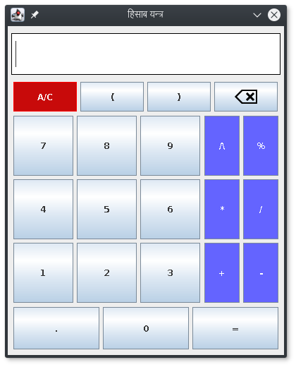
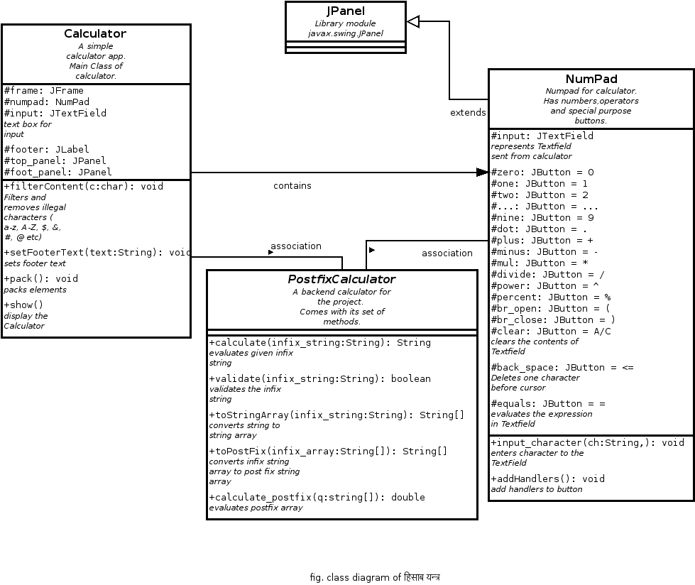
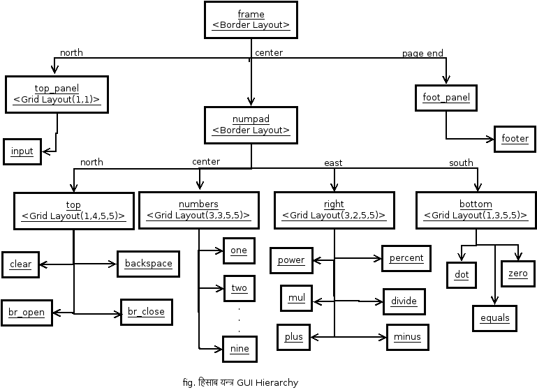

# Calculator ( हिसाब यन्त्र )
Anurag’s
हिसाब यन्त्र


## Introduction 

हिसाब यन्त्र is a desktop application which is implemented in Java Platform. It ,a calculator with basic functionalities, is developed using Java Swing graphical user interface (GUI) toolkit. It supports four basic operations addition, subtraction multiplication, and division.  


## Product Details
### Dependencies
हिसाब यन्त्र is a JAVA application so it requires followings to run properly
1.  a JAVA runtime environment installed on your system 

### Installation
  You can clone the project and compile yourself.<br/>
  If you prefer a jar file then click <a href="https://github.com/anurag1234565/Calculator/raw/master/hisab_yantra.jar">Download</a>.

### User Interface
हिसाब यन्त्र is very user friendly and intuitive and uses a GUI interface implemented in JAVA to communicate with user.<br/>
  <br/>
Fig. हिसाब यन्त्र

### Features
The features of  हिसाब यन्त्र are:
1. Two way input:
      You can input from both buttons on the screen as well as from your keyboard.
2. Operations: 
      You can do addition, subtraction, multiplication, division, power and precentage.
3. Shortcuts:
      ESC clears the input field and RETURN evaluates the expression in the field.
4. Auto-remove invalid characters:
      It automatically removes invalid characters such as alphabets, other special symbols etc.  
4. Opens Under Mouse Pointer:
      The window opens where the pointer of your mouse lies on the screen.
6. Pop-Up Message:
      If the entered expression is wrong then a message pop-ups saying your expression is wrong. 

### Future goals
The future goals for this project are:
1. Bracket completion
2. Enable use of trigonometric ratios


## Code Description

### Class Diagram
 

### GUI Hierarchy
 
 
 For further documentation view <a href="https://anurag1234565.github.io/Calculator/doc/">Javadoc</a>.
 
### Usage
##### Create and Display 
You can create a calculator by making the object of Calculator
```java
  Calculator calc = new  Calculator();  // initializes calculator
```
It initializes the calculator and its components.

Now to pack those components call ` pack() `
```java
  calc.pack();  // packs components to the frame
```
Then to make calculator visible call ` show() `
```java
  calc.show();  // display the calculator
```
##### Add Footer Text [Optional]
If you want to add some text in the footer you can use `setFooterText(text)`
Here `text` is an argument of type text which you want to put in footer.
```
  calc.setFooterText("This is footer text");  // sets footer text
```
  <i> Use this method before packing </i>
